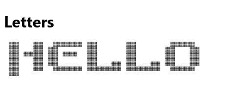

# Old school style demo effects

This repo will contain various old chool style demo effects rewritten in Typescript.

# 1.) Letters #
 This example is based on an old school C64 demo effect. 
It parses a Bitmap font to extract the shape of each letter, renders another image to geneate a string of text as seen below:

