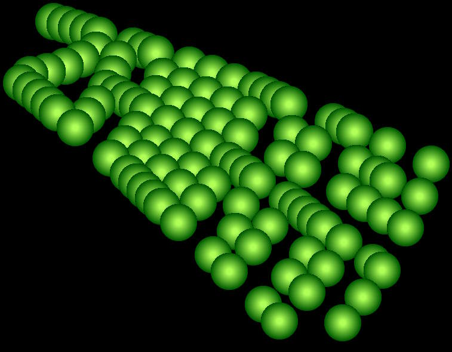
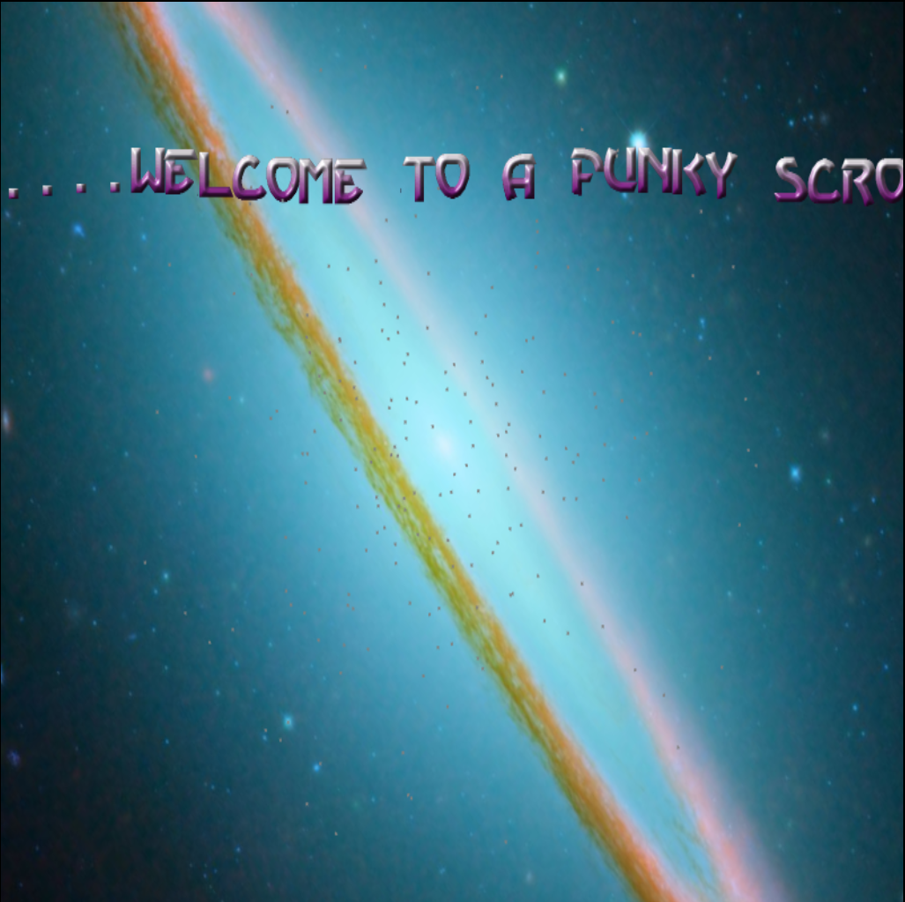

# Old school style demo effects

This repo will contain various old school style demo effects rewritten in Typescript.

# 1.) Letters #
 This example is based on an old school C64 demo effect. 
It parses a Bitmap font to extract the shape of each letter, renders another image to generate a string of text as seen below:

# 2.) Balls #
 This example is a conversion of part of a demo written in Blitz Basic by Zawran to Typescript.

# 3.) Intro #
 This example is an update to the old main page from website rewritten in Typescript.

